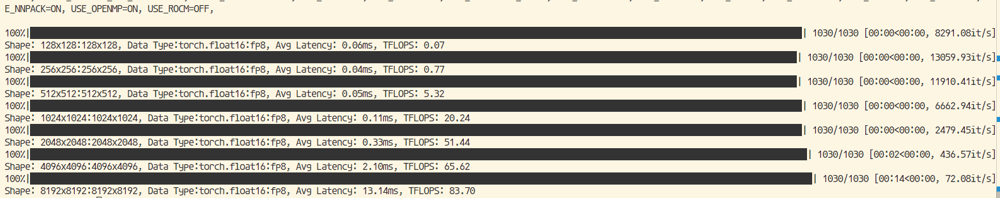
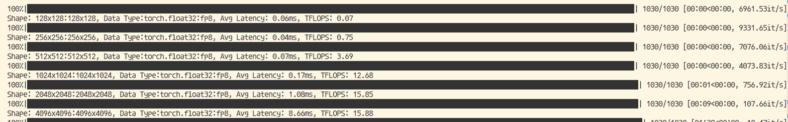
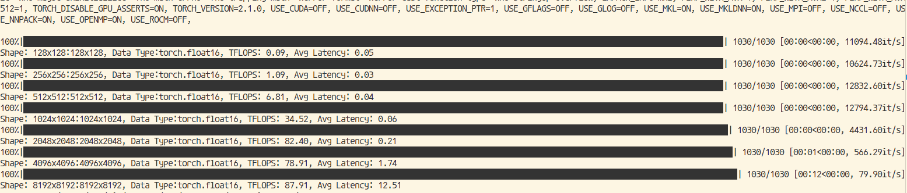
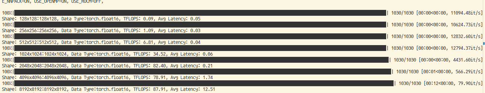

# runing on A770 one card with docker image `intelanalytics/ipex-llm-serving-xpu:2.2.0-b7`

## Set Env

using following script to start a docker container, all experiments run in container.

```bash
#!/bin/bash
export DOCKER_IMAGE=intelanalytics/ipex-llm-serving-xpu:2.2.0-b7
export CONTAINER_NAME=junwang-llm-b7

docker rm -f $CONTAINER_NAME
sudo docker run -itd \
    --privileged \
    --net=host \
    --device=/dev/dri \
    --name=$CONTAINER_NAME \
    -e no_proxy=localhost,127.0.0.1 \
    -e http_proxy=http://proxy.iil.intel.com:911 \
    -e https_proxy=http://proxy.iil.intel.com:911 \
    --shm-size="32g
```

## using Xe_linear test matmul

### steps

1. set env vars

```bash
source /opt/intel/oneapi/setvars.sh
export BIGDL_IMPORT_IPEX=0
```

2. run following python script, change the `dtype` to use `torch.float16` or `torch.float32` and run following cmd

```bash
python bench_matmul_xelinear.py
```

### res

1. fp16

2. fp32


## using torch.matmul test matmul

### steps

no need set vars, change the `dtype` to use `torch.float16` or `torch.float32` and run following cmd

```bash
python bench_matmul.py
```

### res

1. float16

2. float32

